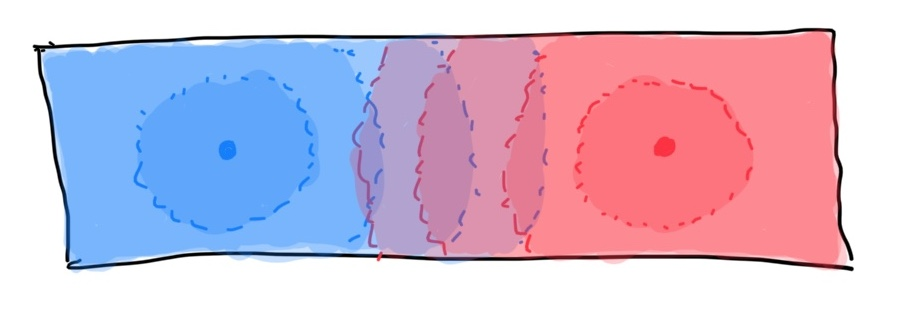
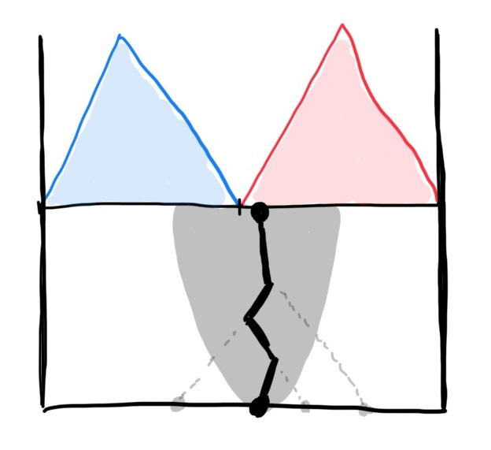
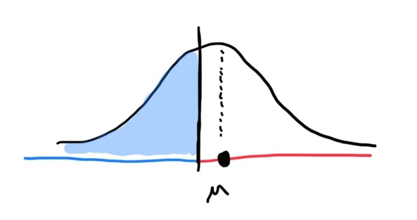
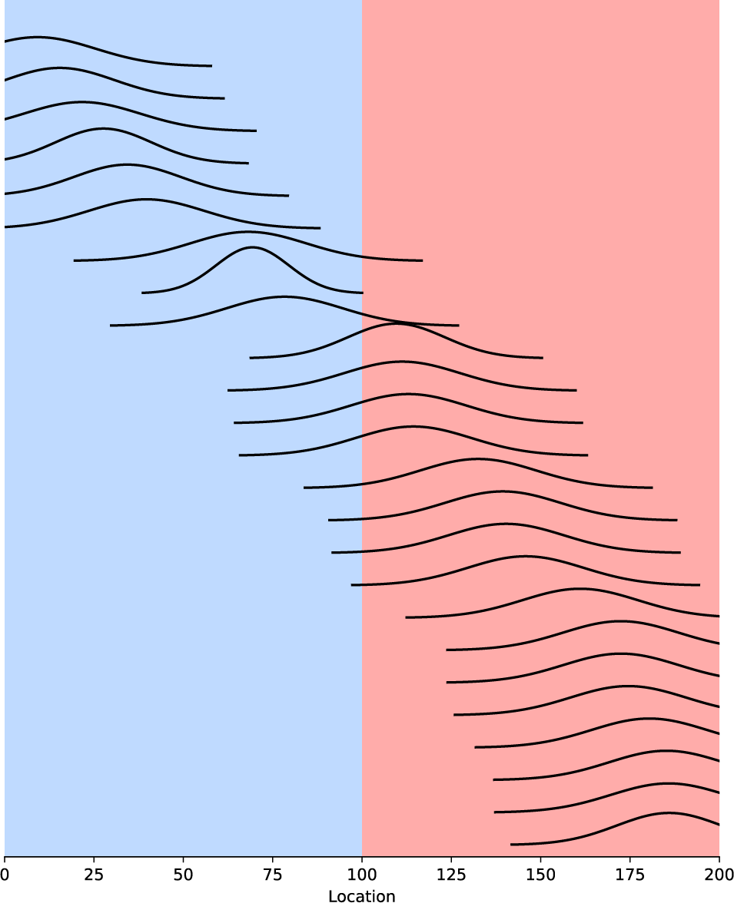

# Topics

- Background on expansion from refugia
- Simulation of two expansion waves colliding
- Estimating ancestral origin based on Brownian motion

---

### From 2025-02-06 to 2025-02-20

I've written a SLiM simulation that has two expanding populations starting on either end of a corridor. The populations grow at the same rate and the expansion waves meet in the middle of the corridor approximately 1000 generations before present.

Looking at this just along the x-axis and plotted against time, we see that the refugia expand like a cone until they collide, after which individuals from each refugia begin mixing. If we sample randomly and look at the tree that relates the samples, we will see two sub-trees (one for each refugia, if fully coalesced).

There are many options to fully model the movement throughout the expansion and mixing. During mixing, movement likely resembles Brownian motion as long as waves properties are equal. One important fact that helps simplify things is that if we know the exact time that the waves meet in the middle of the corridor, we can identify which refugia the lineage goes back to based on whether it is found to the left or right of the middle. For example, it is not possible for the lineage to jump go to the red origin if it is found on the left side of the corridor.

To estimate the location estimate distribution for each sample at the time that the waves meet, I chopped the tree at that time (currently an arbitrary time in the past but will figure out the exact time analytically). I then ran `sparg` on this chopped tree to get the MLE and variance for the ancestral locations.

I then calculated the CDF of the location given the MLE ($\mu$) and variance ($\sigma^2$) to determine how much of the distribution was less than the middle of the corridor (to the left of the middle). For this is used `scipy.stats.norm.cdf(100, mu, np.sqrt(var))` which uses the calculation: $\Phi(\frac{x-\mu}{\sigma})$ where $\Phi(x)$ is the CDF of the standard normal distribution and the modifications to $x$ are rescaling things to fit our non-standard normal distribution. This gives you the probability of the sample originating from the blue refugia; $1-\Phi(\frac{x-\mu}{\sigma})$ is then the probability of the sample originating from the red refugia.

Each curve is the location distribution of a sample ancestor at 1250 generations in the past, approximately when the two expansions waves met. The CDF measures the proportion of the area under the curve that is in blue region, which means that with certainty the lineage had to go back to the the blue refugia. The shape of the curve is dependent on how many coalescent events there were after chopping the tree. Approximately half of the lineages did not have a coalescence with another lineages within the 1250 generations, so they just have simple Brownian motion on the way back and wide uncertainty in location. 

This only models the motion after the waves have collided, we still need some way of modeling what's happening before that collision. As Graham suggested, the simplest scenario would be collapsing all lineages back immediately to form two panmictic populations, one for each refugia. This non-spatial model could work well for rapidly expanding waves as that reduces the time in between expansion and collision. Knowing the probability that the lineage is in a given refugia, we could combine that with the panmictic dynamics to calculate the likelihood of the tree.

Now that I'm writing this, I don't know if chopping the tree and treating this as a two-step process is correct. Knowing the connections above when you chop greatly inform the probability of which refugia you are go back to. A single lineage's distribution may be able to straddle between the two at the time the waves collide, but if it coalesces with lineages that could only go back to one, then it necessarily also has to go back to that one. I don't know... I might have turned myself around, but this would be worth discussing in the next meeting. I understand the scenario where both lineages have some chance of being in each refugia, but not necessarily if only one can or even worse if they are estimated to go back to separate refugia.