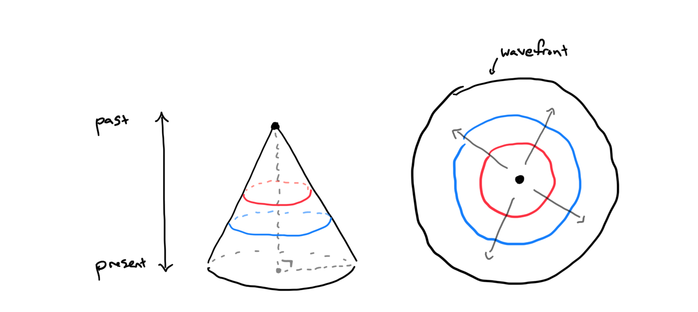
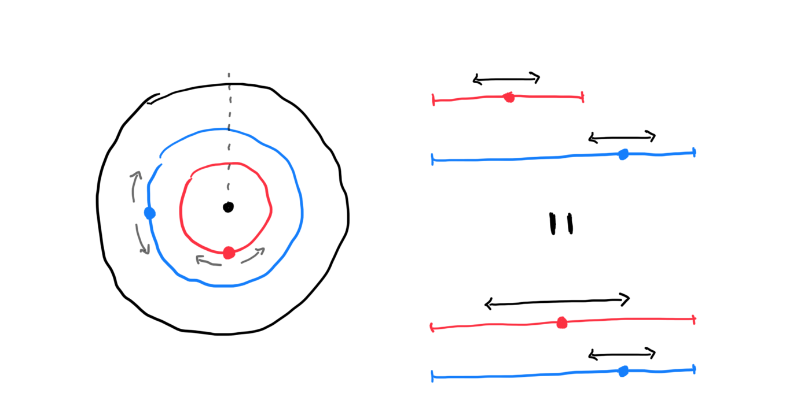
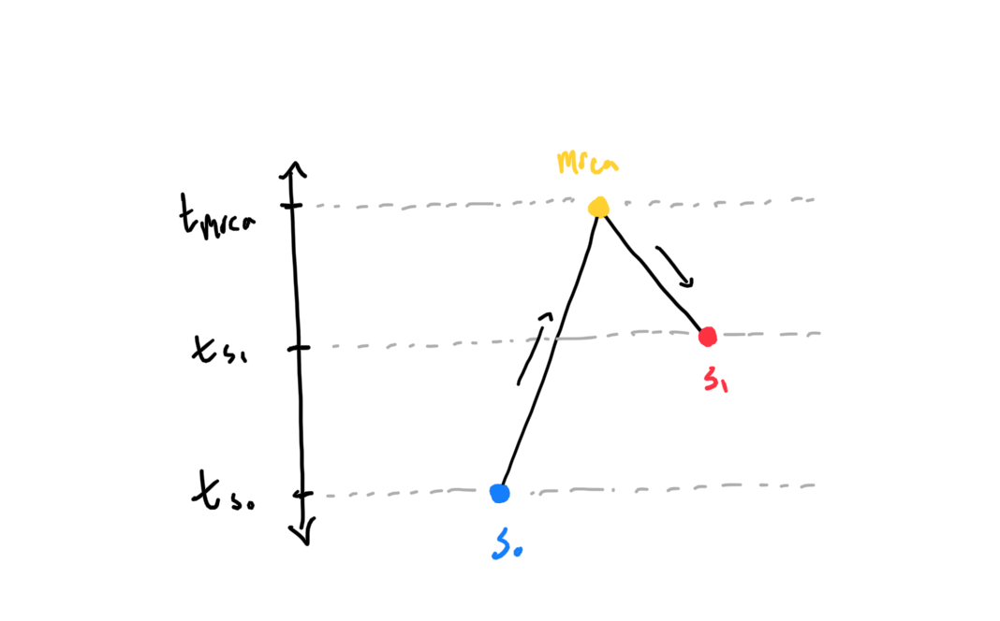

# Topics

- Wavefront in 2D

---

### From 2025-04-18 to 2025-04-20

In our meeting on 2025-04-17, we talked about how movement in two dimensions comes with complications that we haven't worked out how to model. In some ways, it might be more efficient to work things out in two dimensions off the bat, as the dynamics between one and two dimensions are very different. I also like how visual some of the dynamics are, so will be drawing a few different possible figures to try to explain things.

Say we want to model the expansion of a single refugia in two dimensions over time. We can draw this as a cone with time along the height axis of the cone and the two spatial dimensions slicing through the cone. The point of the cone represents the location of the refugia in the deep past, and as we move forward in time, lineages move out in a growing circle around that refugia. When a lineage is in the volume of the cone, we model its movement using 2D Brownian motion backwards in time. The moment that the lineage reaches the surface of the cone, the dynamics change.

From here forward, we refer to the surface of the cone as the "wavefront". When a lineage reaches the wavefront, we know that it will remain on the wavefront all the way back to the refugia. Thinking in forward in time, this is because lineages move really quickly outward from the refugia when they are pushed by the wavefront, but the moment they fall off of the wave, they no longer have that extra boost to movement, so begin moving more slowly, and are unlikely to make it back on the wave. Importantly, even though the lineage is stuck to the wavefront, it is not moving in a straight line back to the refugia. Instead, the lineage is likely to slide along the contour rings of the surface as it works its way back to the origin. Our idea is to model this specific movement.

At time $t$, there is a ring of positions around the surface of the cone for the lineage to move on. We can model movement here as Brownian motion on a 1D ring. The circumference of this ring is $C=2\pi*r_t$, but we know that $C$ shrinks as we move back in time. Brownian motion on a shrinking ring may be worked out, but our idea is that shrinking the ring should be equivalent to increasing the dispersal rate, which certainly has been studied before. If $\sigma_t$ is the dispersal rate along the contours of the wavefront at time $t$ and the wave is retracting at rate $v$, then $\sigma_t=\frac{\sigma_0r_0}{r_0-vt}$. Potential notation issue here is that I'm using the subscript $X_0$ for $X$ at present time, as I'm thinking about moving backwards in time. Gabriele had been using it to denote the expansion origin time. I'm up for changing my notation, but I don't know what would make the most sense.

Graham pointed out that we should be using the [wrapped normal distribution](https://en.wikipedia.org/wiki/Wrapped_normal_distribution). For now, I'm going to build intuition with the standard normal distribution, and then hopefully things will be transferrable to the wrapped version. Under normal Brownian motion, we have the same scenario as 1D **SpaceTrees** from Matt and Graham except we are now deterministically increasing the dispersal rate overtime. It is also very likely that lineages will contact the surface at different times; we can model this in the same way we would model non-contemporary samples in **SpaceTrees**. Some math: $X_T \sim Normal(x_0, \int_0^T\sigma_t^2dt)$, where $X_T$ is the position of the lineage at time $T$ on the number line. Coalescing can be modelled as a Brownian bridge from the location of one lineage to the next location of the other. This requires us to take into account the different dispersal rates as we track up to the MRCA and then back down, $X_{t_{s_1}} \sim Normal(x_{s_0}, (\int_{t_{s_0}}^{t_{mrca}}\sigma_t^2dt)+(\int_{t_{mrca}}^{t_{s_1}}\sigma_t^2dt))$.

This assumes that we can move forward and backward in time along these edges, while accounting for the changing dispersal rate. I believe that this is fine, but we may want to confirm.